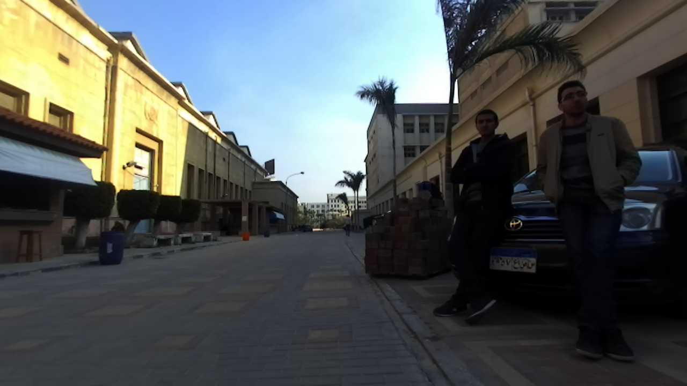
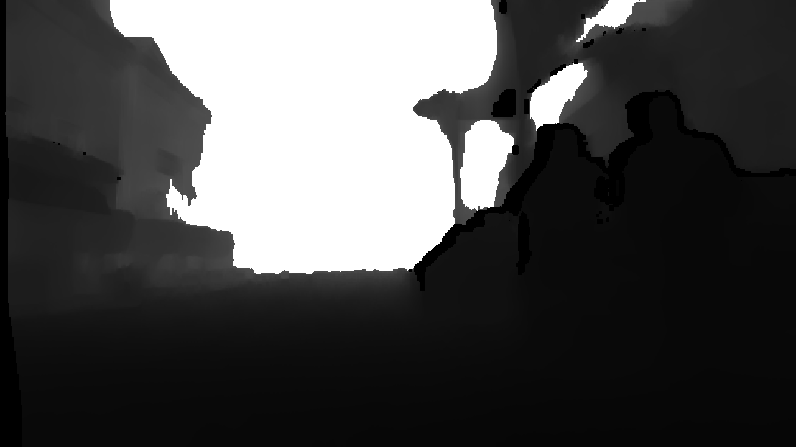
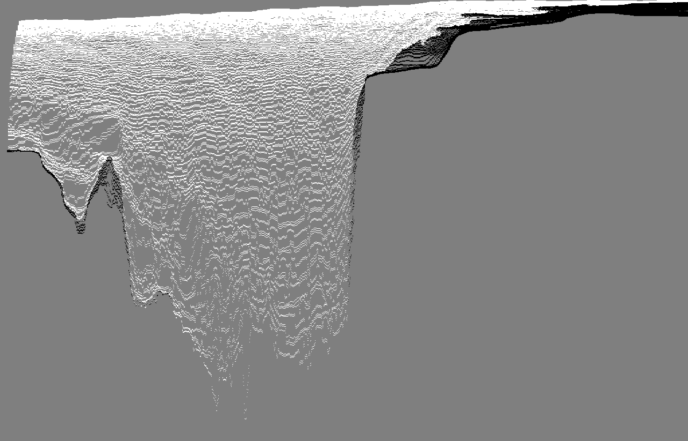
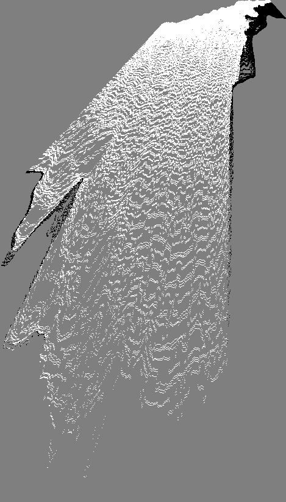
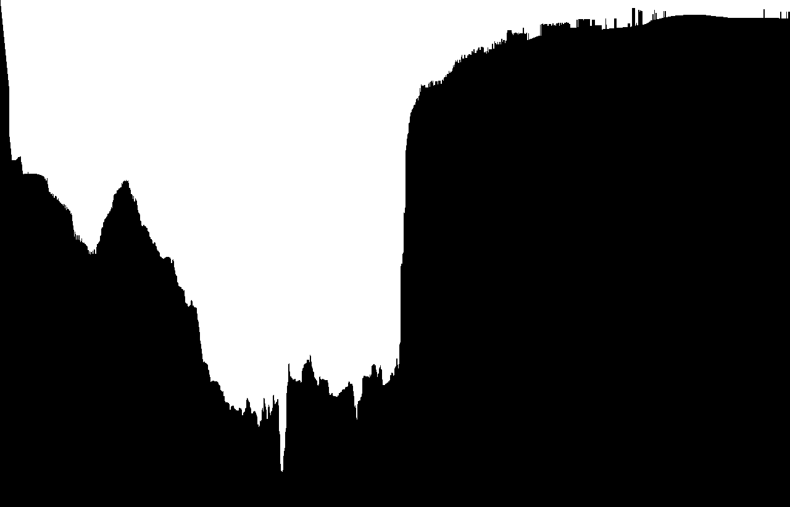
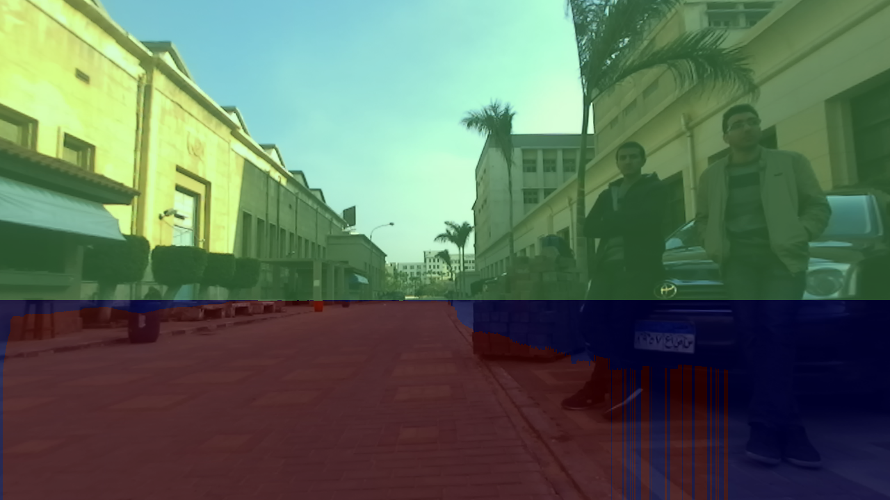
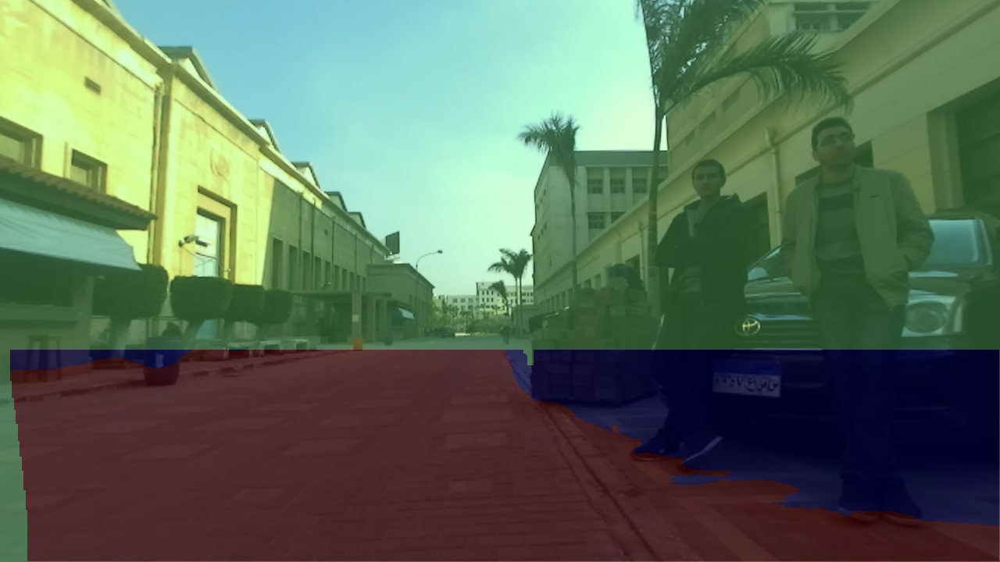

### Free Space and obstacle detection using occupancy grids
**Tools:** OpenCV 2.4, C++, CUDA. 

This impelementaion is based on [Free Space Computation Using Stochastic Occupancy Grids and Dynamic Programming](http://vision.jhu.edu/iccv2007-wdv/WDV07-badino.pdf)
with some modifications.

The code is tested with Zed stereo camera and nvidia jetson tk1, and the parameters depend on the camera(calibraion) and the position of the camera.

This repo is still under development.

To make cpu and gpu code

type `make` then `make run`

To make CPU only, remove `#define GPU` from `main.cpp`

type `make cpu` then `make run_cpu`

To make GPU only, remove `#define CPU` from `main.cpp`

type `make gpu` then `make run_gpu`

**Input image and its Depth**

**Polar Occypancy Grid with different sizes**

**Cartesian Occypancy Grid with different sizes**

**Segmentation of polar grid** 

**Thresholding**

**Free space**

**Dynamic programming**

**Free space**

**GPU Implementation**

